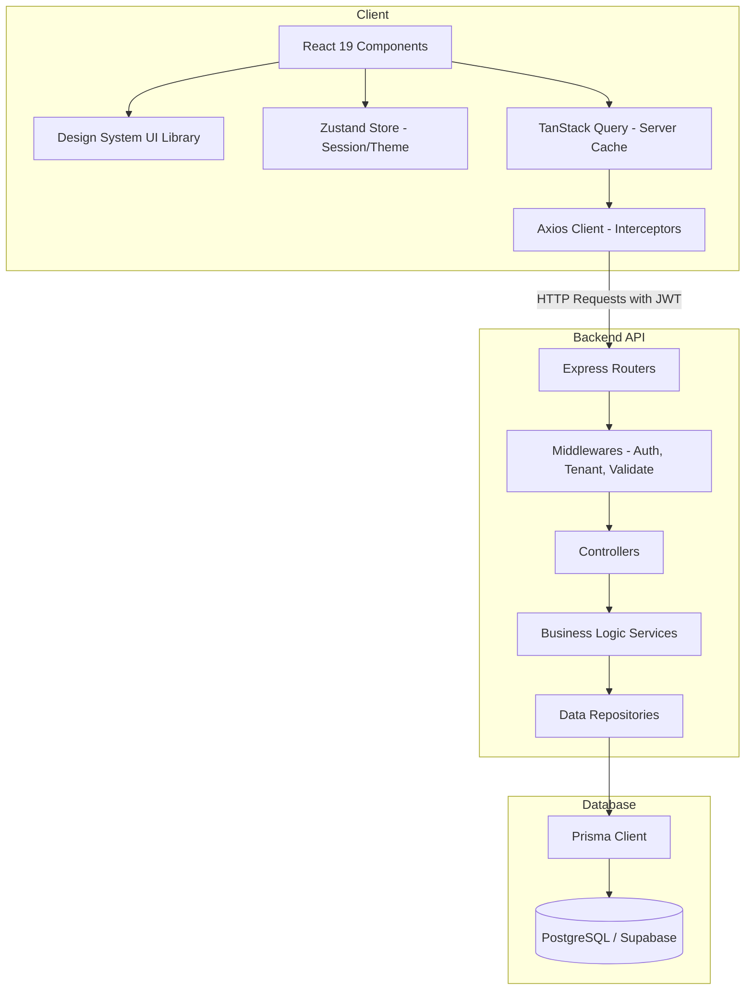

# Case Study & Project Audit: Enterprise Multi-Tenant AI-CRM Platform

This document presents a comprehensive case study and deep technical audit of the **AI-CRM Platform** based on the architectural documentation, codebase structure, and database schema.

---

## 1. Project Case Study

### 1.1 Executive Summary
The **AI-CRM Platform** is an enterprise-grade, multi-tenant SaaS CRM (Customer Relationship Management) designed to support organizations of all sizes. The platform isolates data at the tenant (organization) level while offering shared infrastructure. It goes beyond traditional CRMs by offering complete organizational structure management (departments, designations, teams, reporting lines), a robust role-based access control (RBAC) system, pipeline automation, unified communication hubs, and built-in hooks for future AI features (such as lead scoring, automatic smart search, task/email generators).

### 1.2 The Problem It Solves
1. **Data Isolation & Tenant Management**: Multi-tenant systems often struggle with security boundaries. AI-CRM secures and partitions all tables by `tenantId`, ensuring absolute isolation.
2. **Dynamic Organizational Hierarchy**: Most CRMs treat all users flatly. AI-CRM maps departments, teams, team leads, designations, and user managers, mirroring real enterprise reporting structures.
3. **Rigid Workflows**: Rather than forcing a single pipeline, organizations can configure multiple pipelines with custom stages, deal probabilities, and state actions.
4. **AI Latency & Extensibility**: Typical systems require full rewrites to integrate AI. AI-CRM builds AI interfaces directly into the schema (e.g. `score` field on `Lead`, smart search hooks) to allow drop-in AI agents.

### 1.3 Tech Stack Overview
#### Frontend (Single Page App)
* **Framework**: React 19 (using modern concurrent features and hooks)
* **Build Tool**: Vite (fast builds, TypeScript paths, hot-module replacement)
* **Styling**: Tailwind CSS v4 (theme-aware utility classes and lightning CSS engine)
* **State Management**: Zustand (lightweight global store) & TanStack Query v5 (server cache, automatic refetch, mutations)
* **Forms & Validation**: React Hook Form (uncontrolled component binding) & Zod (runtime validation schemas)

#### Backend (REST API)
* **Runtime**: Node.js (>=22.0.0)
* **Framework**: Express 5.x (asynchronous route support, standardized middlewares)
* **ORM**: Prisma ORM (strongly-typed client generator, migration management)
* **Database**: PostgreSQL (Prisma connector, relational constraints, indexed queries)
* **Security & Auth**: JWT tokens (Access and Refresh token flow), Bcrypt password hashing, Helmet headers, Rate limiting, CORS.

---

## 2. Feature Matrix (Structured Breakdown)
Here is the detailed breakdown of the features implemented and planned in the AI-CRM platform.

| Feature Category | Feature Component | Description | Implementation Status |
| :--- | :--- | :--- | :--- |
| **Authentication & Onboarding** | Self-Service Tenant Signup | Atomically creates the Tenant, sets default roles, and registers the Owner user. | Implemented |
| | Secure JWT Login / Logout | Issues short-lived access tokens and database-tracked refresh tokens. | Implemented |
| | User Profile Management | Supports profile pictures, phone numbers, and credentials updates. | Implemented |
| **Tenant & Org Management** | Tenant Isolation | Enforces strict `tenantId` separation across all database operations. | Implemented |
| | Organizational Hierarchy | Defines Departments, Teams, Designations, and Manager-Subordinate reporting. | Implemented |
| | Team Allocation | Assigns users to teams and designates Team Leads. | Implemented |
| **Role-Based Access (RBAC)** | Role CRUD | Allows custom role definitions per tenant. | Implemented |
| | Fine-Grained Permissions | Granular permission settings (e.g. `Lead.Create`, `Lead.Delete`). | Implemented |
| | Permissions Middleware | Intercepts requests to enforce role/user permissions before running controllers. | Implemented |
| **CRM Core Entities** | Company Directory | Manages corporate profiles, industries, sizes, and logos. | Implemented |
| | Contact Directory | Tracks individual business contacts, job titles, and communications. | Implemented |
| | Lead Management | Custom pipelines, lead sources (Website, Referral, LinkedIn), and status tracking. | Implemented |
| | Pipeline & Stages | Drag-and-drop pipelines with probability ratings and customized win/loss stages. | Implemented |
| | Deals & Sales | Open, Won, or Lost deals tracked with currency support (default INR). | Implemented |
| **Activities & Tasks** | Task Board | Creates tasks, sets priorities (Low, Medium, High, Urgent), due dates, and assignees. | Implemented |
| | Interaction Logs | Timeline of Calls, Meetings, Emails, and general Activity Logs. | Implemented |
| | Note-Taking | Attaches persistent markdown notes to leads, companies, and deals. | Implemented |
| **Platform Services** | Communication Hub | Tracks emails, SMS, WhatsApp, and internal messages. | Implemented |
| | Notification Engine | Dispatches In-App, Email, or Push notifications based on status updates. | Implemented |
| | File Uploads | Uploads logos, avatars, and documents via Multer middleware. | Implemented |
| | Audit Logs | Automatically records login/logout events, CRUD logs, and security activities. | Implemented |
| **AI Subsystem (Future)** | AI Lead Scoring | Automatically ranks leads by conversion likelihood using historical data. | Schema Ready |
| | Smart Search | Semantic queries to search across leads, companies, and tasks. | Planned |
| | AI Generators | Automatic email templates and task suggestions. | Planned |

---

## 3. Architecture Deep Dive & Life Cycles

### 3.1 System Architecture Diagram


### 3.2 Request-Response Lifecycle
1. **Frontend Collection**: The user submits a form. React Hook Form binds inputs, and Zod validates client-side constraints.
2. **API Handshake**: A custom React Hook executes a TanStack query/mutation. This calls the Axios Client, which injects the `Authorization` header (JWT Bearer Token) and the `x-tenant-id` header.
3. **Routing & Authentication**: The Express Router routes the request. The request hits the `authGuard` middleware to verify the JWT and verify if the user's tenant matches the requested scope.
4. **DTO Validation**: Zod middleware on the backend validates the request body against a predefined schema, stripping out unexpected fields.
5. **Business Service Layer**: The controller accepts the request and delegates execution to the corresponding Service (e.g. `leadService.assignLead()`), ensuring zero HTTP details touch business logic.
6. **Data Access (Repository)**: The Service calls a Repository (e.g., `leadRepository.update()`). The repository uses the Prisma Client to perform queries.
7. **Database Isolation**: The PostgreSQL engine performs the query inside the tenant's context, maintaining relational integrity.
8. **Response Formatting**: The data bubbles back up, gets wrapped in a standard JSON response (`{ success: true, data: ... }`), and is returned to the client.

---

## 4. Technical Audit & Health Check

During our deep-dive review of the codebase, we conducted an audit of configuration files, database schemas, route registration, and middleware code. Here are the core findings:

### 4.1 Positive Highlights
1. **Design System Modularity**: The frontend contains a highly reusable design system (`src/design-system`) split into base components (Button, Input, Switch, Textarea), display components (Avatar, Badge, Divider, Typography), data display (Card, EmptyState, Text), and feedback (Alert, Progress, Spinner, Skeleton, Toast, PageLoader). The theme provider handles light and dark mode styling.
2. **Clear Separation of Concerns**: Strict boundary lines exist between folders. Features (e.g., `auth`, `dashboard`) encapsulate their own API hooks, schemas, and routes, making refactoring or team scaling easier.
3. **Repository Pattern Implementation**: The repository files (e.g., `user.repository.ts`, `company.repository.ts`) prevent services from directly touching Prisma queries, simplifying database mocking during tests.
4. **Strong Validation Layer**: Both frontend and backend leverage Zod schema validation, mitigating SQL injection, parameter pollution, and standard payload errors.

### 4.2 Discrepancies & Discovered Bugs
While the architecture is overall solid, there are critical bugs and inconsistencies that require attention:

#### 1. Express Error Handler Registration Sequence Bug (High Priority)
* **File Location**: [app.ts](file:///d:/A1codes/Chatgptdevelopment/Projects/AI-CRM/apps/api/src/app.ts) (lines 33-38)
* **Issue**:
  ```typescript
  app.use(cookieParser());
  app.use(globalErrorHandler);
  app.use("/api", routes);
  ```
  In Express, error-handling middleware (middleware with four arguments: `err, req, res, next`) must be registered **at the very bottom** of the middleware stack, *after* all routers. Since `globalErrorHandler` is registered *before* `/api` routes, any errors thrown inside controllers/services will bypass the global handler and crash the response or leak detailed HTML stack traces to the client.
* **Fix**: Move `app.use(globalErrorHandler)` below `app.use("/api", routes)`.

#### 2. PostgreSQL Schema vs. MySQL Documentation Discrepancy
* **File Location**: [schema.prisma](file:///d:/A1codes/Chatgptdevelopment/Projects/AI-CRM/database/prisma/schema.prisma) vs [10-Database-Architecture.md](file:///d:/A1codes/Chatgptdevelopment/Projects/AI-CRM/docs/10-Database-Architecture.md)
* **Issue**: The documentation states "The backend uses MySQL with Prisma ORM." However, `schema.prisma` is configured with `provider = "postgresql"` and uses connection settings for a PostgreSQL/Supabase database.
* **Impact**: If deployment scripts expect a MySQL database container, the application will crash during migrations.
* **Fix**: Update the system documentation to align with PostgreSQL or change the Prisma datasource provider to MySQL if that is the target engine.

#### 3. Redundant Error Catching in Controllers
* **File Location**: [auth.controller.ts](file:///d:/A1codes/Chatgptdevelopment/Projects/AI-CRM/modules/auth/controllers/auth.controller.ts) (and other controllers)
* **Issue**: Controllers are manually wrapping every method inside `try/catch` and returning error JSON payloads:
  ```typescript
  register = async (req: Request, res: Response) => {
    try {
      const result = await this.authService.register(req.body, req.file);
      return res.status(201).json(result);
    } catch (error: any) {
      return res.status(400).json({ message: error.message });
    }
  };
  ```
  This defeats the purpose of the `asyncHandler` wrapper and the `globalErrorHandler`. If errors were simply allowed to bubble up, the global handler would standardize error statuses, log the stack trace using Pino, and sanitize response schemas.
* **Fix**: Wrap controller actions using `asyncHandler` and let them throw directly to the global error middleware.

#### 4. Empty Test Suites
* **File Location**: [tests/](file:///d:/A1codes/Chatgptdevelopment/Projects/AI-CRM/tests) subfolders (`unit`, `integration`, `e2e`, `performance`)
* **Issue**: While the testing folders exist, they are completely empty. The package.json has a test runner configured with `jest`, but there are no active test files.
* **Fix**: Set up a baseline suite of unit tests for auth services and database repositories.

---

## 5. Architectural Recommendations & Roadmap

To evolve the CRM platform towards its production-ready and AI-ready goals, we recommend the following roadmap:

1. **Step 1: Fix Core Server Bugs**: Re-order the error handler middleware in `app.ts` to restore centralized error tracking.
2. **Step 2: Sync Schema & Documentation**: Standardize database credentials, local docker configurations, and deployment targets (PostgreSQL vs MySQL).
3. **Step 3: Build CRM Analytics Widgets**: Since the dashboard is currently relying on mock data (`dashboard.mock.tsx`), implement real aggregation queries in the `activity`, `lead`, and `deal` repositories.
4. **Step 5: Setup CI/CD and Lint Hooks**: Integrate automated tests, type checks (`tsc --noEmit`), and linter rules into git commits to enforce design pattern boundaries.
